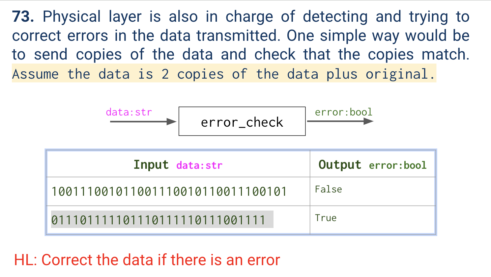
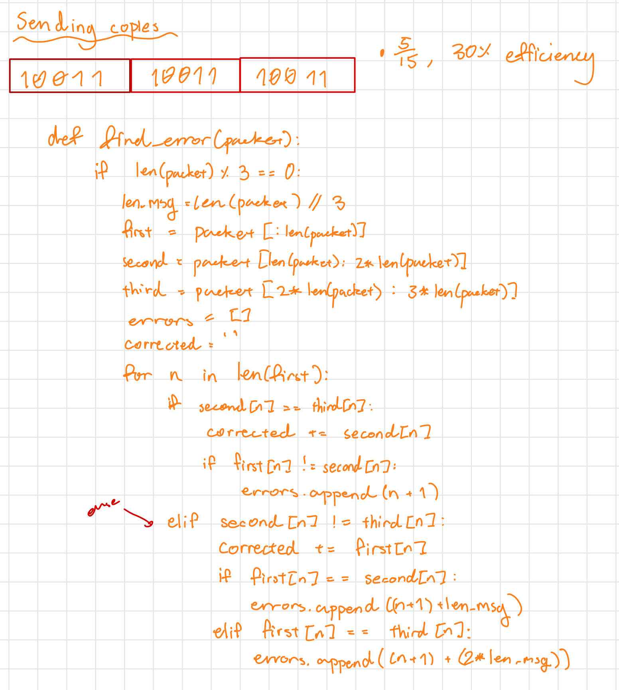

# Quiz 073
<hr>

### Prompt

*fig. 1* **Screenshot of quiz slides**

### Working

*fig. 2* **Screenshot of working**

### Solution
```.python
def check_for_error(packet: str) -> str:
    if (len(packet) % 3 == 0) and (packet.count('0') + packet.count('1') == len(packet)):
        len_msg = len(packet) // 3
        first = packet[:len_msg]
        second = packet[len_msg:(2 * len_msg)]
        third = packet[(2 * len_msg):(3 * len_msg)]

        errors = []
        corrected = ''
        for n in range(0, len(first)):
            if second[n] == third[n]:
                corrected += second[n]  # taking the majority, hence regardless of first[n]
                if first[n] != second[n]:
                    errors.append(n + 1)  # plus one for the bit number which isn't the index number
            elif second[n] != third[n]:
                corrected += first[n]  # taking the majority, hence first[n] will always be the majority
                if first[n] != second[n]:
                    errors.append((n + 1) + len_msg)
                elif first[n] != third[n]:
                    errors.append((n + 1) + (2 * len_msg))

        if len(errors) != 0:
            return f"There were errors at bits {errors}. The corrected message is {corrected}."
        else:
            return f"There were no errors. The correct message is {corrected}."

    else:
        return "There is an uncorrectable error: length of packet not a multiple of 3, or characters other than 0 and 1 identified."

# Check that it works
print(check_for_error('100111001011001110010110011100101'))
print(check_for_error('011101111101110111110111001111'))
```
### Evidence

*fig. 3* **Screenshot of working/solution**