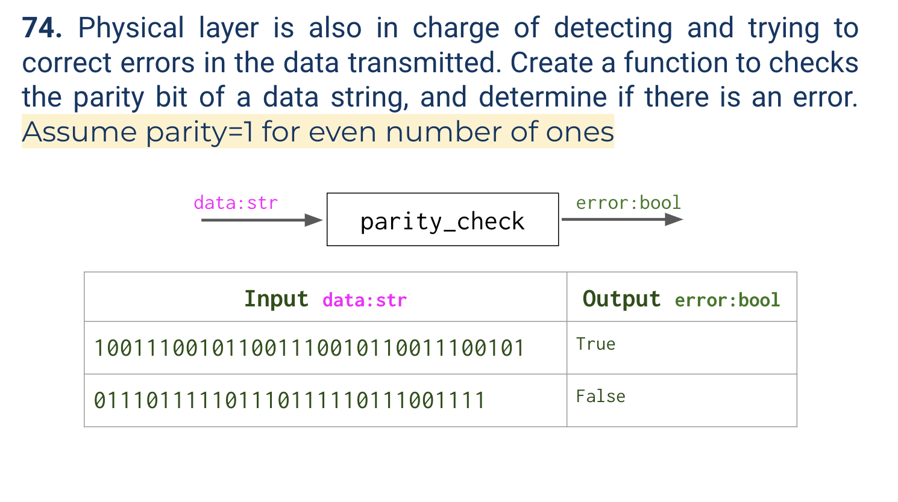
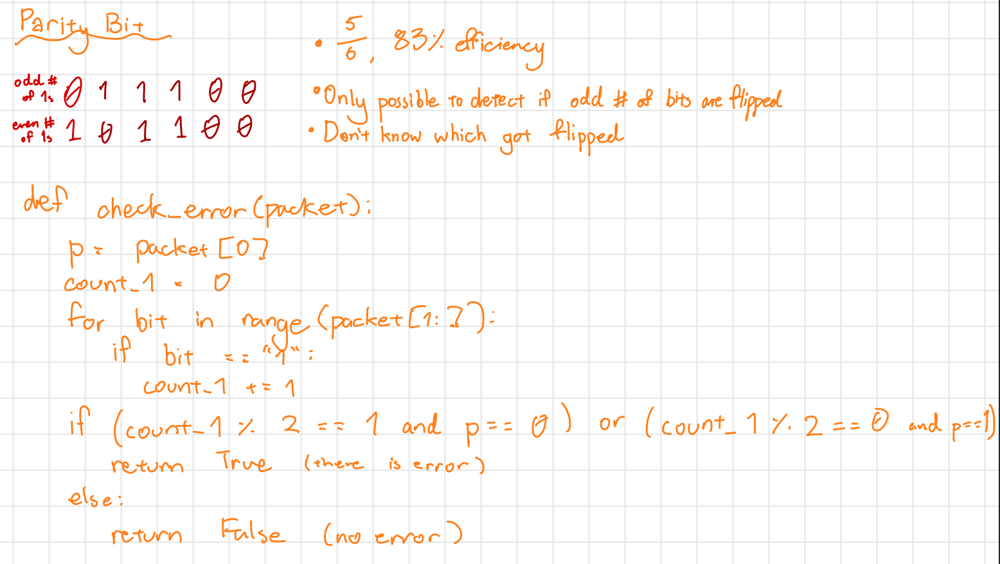
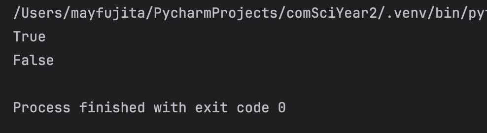

# Quiz 074
<hr>

### Prompt

*fig. 1* **Screenshot of quiz slides**

### Working

*fig. 2* **Screenshot of working**

### Solution
```.python
def check_error_with_parity_bit(bits:str) -> bool:
    has_error = False
    count = 0
    for n in range(1, len(bits)):
        if bits[n] == '1':
            count += 1
    if (bits[0]=='0') and (count % 2 != 1):  # Should have odd number of 1s
        has_error = True
    elif (bits[0]=='1') and (count % 2 != 0):  # Should have even number of 1s
        has_error = True
    return has_error


# Check if it works
print(check_error_with_parity_bit('100111001011001110010110011100101'))
print(check_error_with_parity_bit('011101111101110111110111001111'))
```
### Evidence

*fig. 3* **Screenshot of working/solution**