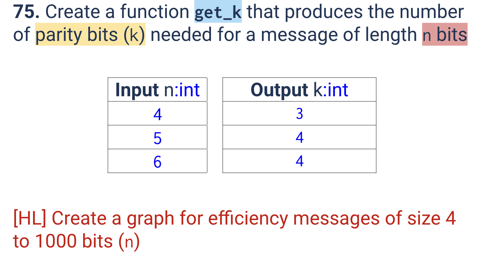

# Quiz 075
<hr>

### Prompt

*fig. 1* **Screenshot of quiz slides**

### Working

*fig. 2* **Screenshot of working**

### Solution
```.python
from matplotlib import pyplot as plt

def find_num_of_parity_bits(len_msg: int) -> int:
    k = 0
    while 2 ** k <= len_msg + k + 1:
        k += 1
    return k

# HL: Graph
x = []
y = []
for n in range(0, 1001):
    x.append(n)  # Where n represents the length of message
    y.append((n/(n+(find_num_of_parity_bits(n)))))

plt.plot(x, y, color="gray")
plt.xlabel("Length of Message", fontsize=15)
plt.ylabel("Efficiency", fontsize=15)
plt.show()

# # Check that it works
print(find_num_of_parity_bits(4))
print(find_num_of_parity_bits(5))
print(find_num_of_parity_bits(6))
```
### Evidence

*fig. 3* **Screenshot of working/solution**


*fig. 4* **Screenshot of graph of length of message against efficiency**