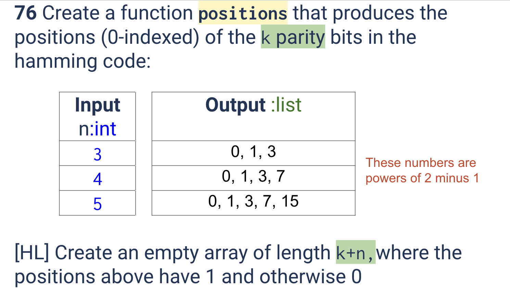
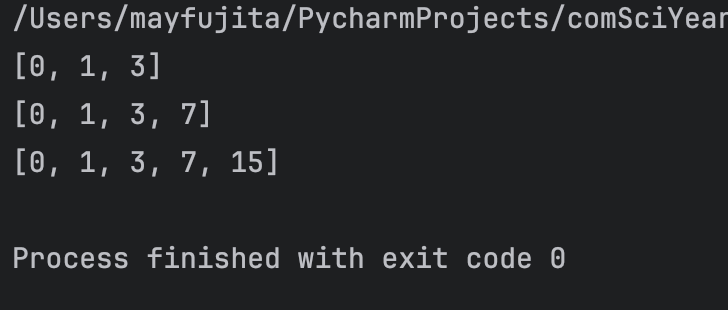

# Quiz 076
<hr>

### Prompt

*fig. 1* **Screenshot of quiz slides**

### Solution
```.python
def find_parity_indices(k: int) -> list[int]:
    positions = []
    for n in range(k):
        positions.append((2 ** n) - 1)
    return positions

# Check to see it works:
print(find_parity_indices(3))
print(find_parity_indices(4))
print(find_parity_indices(5))
```
### Evidence

*fig. 2* **Screenshot of working/solution**