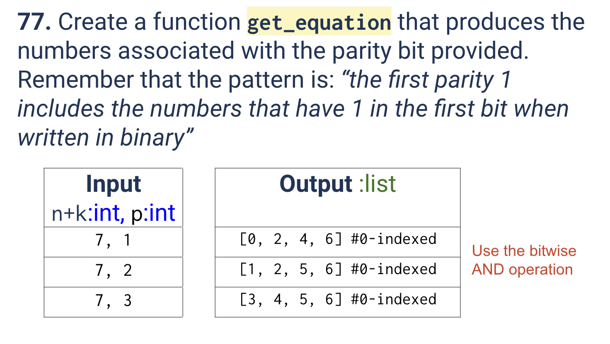
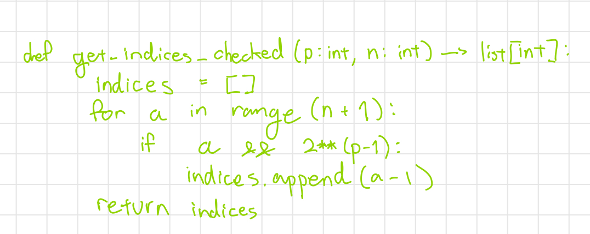
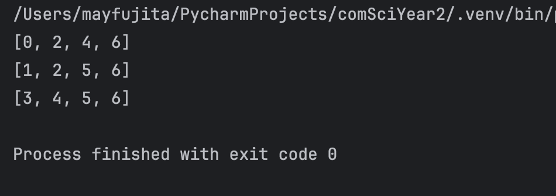

# Quiz 077
<hr>

### Prompt

*fig. 1* **Screenshot of quiz slides**

### Working

*fig. 2* **Screenshot of working**

### Solution
```.python
def get_indices_checked(p: int, msg_len: int) -> list[int]:
    """Gets the 0-indexed indices of the bits checked by the p-th parity bit.
    p: int, the p-th parity bit
    msg_len: the length of the total message including parity bits
    """

    indices = []
    for a in range(msg_len+1):
        if a & (2 ** (p - 1)):
            indices.append(a - 1)
    return indices

# Check that it works
print(get_indices_checked(msg_len=7, p=1))
print(get_indices_checked(msg_len=7, p=2))
print(get_indices_checked(msg_len=7, p=3))

```
### Evidence

*fig. 3* **Screenshot of working/solution**