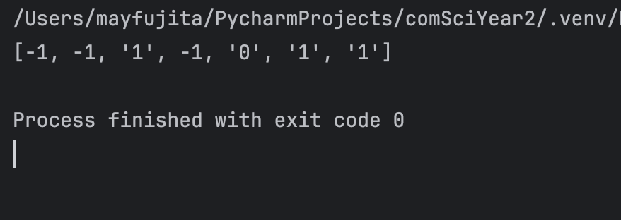

# Quiz 078
<hr>

### Prompt

*fig. 1* **Screenshot of quiz slides**

### Solution
```.python
def create_message(msg: str) -> list:
    output = []
    k = find_num_of_parity_bits(len(msg))
    pos = find_parity_indices(k)

    msg_index = 0
    for n in range(len(msg) + k):
        if n in pos:  # Where a parity should be
            output.append(-1)
        else:
            output.append(msg[msg_index])  # Actual value of the message
            msg_index += 1
    return output

# Check that it works
print(create_message('1011'))
```
### Evidence

*fig. 2* **Screenshot of working/solution**