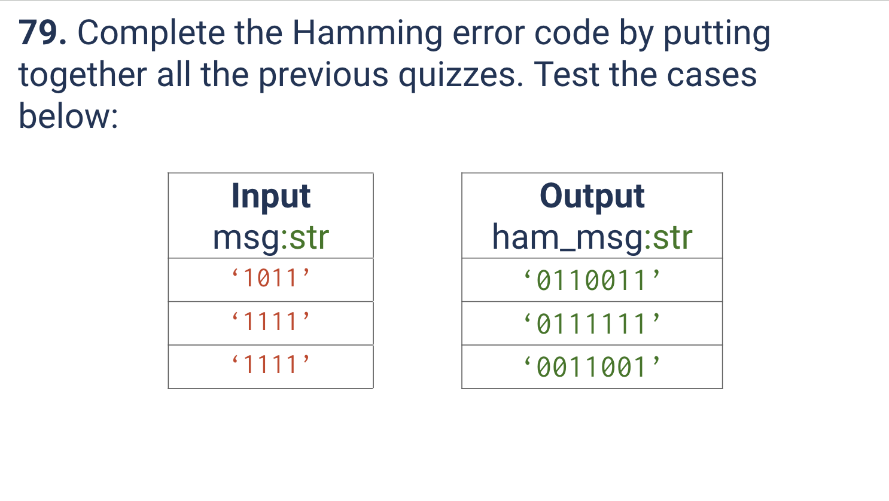
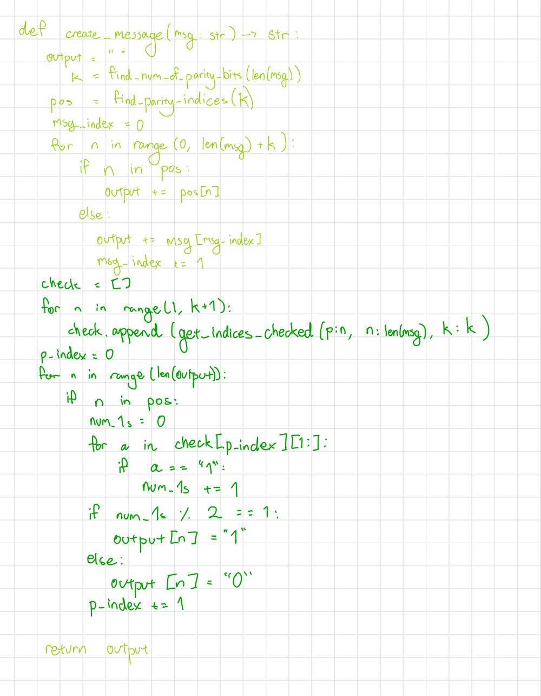
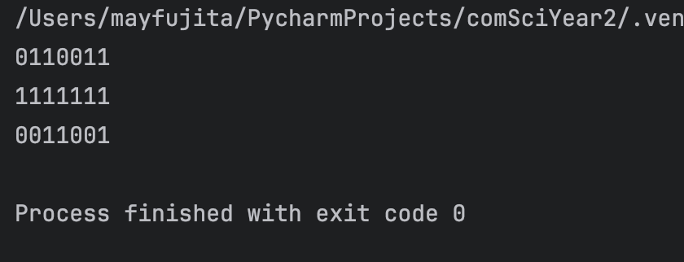

# Quiz 079
<hr>

### Prompt

*fig. 1* **Screenshot of quiz slides**

### Working

*fig. 2* **Screenshot of working**

### Solution
```.python
def create_message(msg: str) -> str:
    output = []
    k = find_num_of_parity_bits(len(msg))
    pos = find_parity_indices(k)

    msg_index = 0
    for n in range(len(msg) + k):
        if n in pos:  # Where a parity should be
            output.append(-1)
        else:
            output.append(msg[msg_index])  # Actual value of the message
            msg_index += 1

    check = []
    for n in range(1, k + 1):
        check.append(get_indices_checked(p=n, msg_len=(len(msg)+k)))

    p_index = 0
    for n in range(len(output)):
        if n in pos:
            num_1s = 0
            for a in check[p_index][1:]:
                if output[a] == "1":
                    num_1s += 1
            if num_1s % 2 == 1:
                output[n] = "1"
            else:
                output[n] = "0"
            p_index += 1

    return ''.join(output)
    
# Test that it works:
print(create_message(msg='1011'))
print(create_message(msg='1111'))
print(create_message(msg='1001'))
```
### Evidence

*fig. 3* **Screenshot of working/solution**