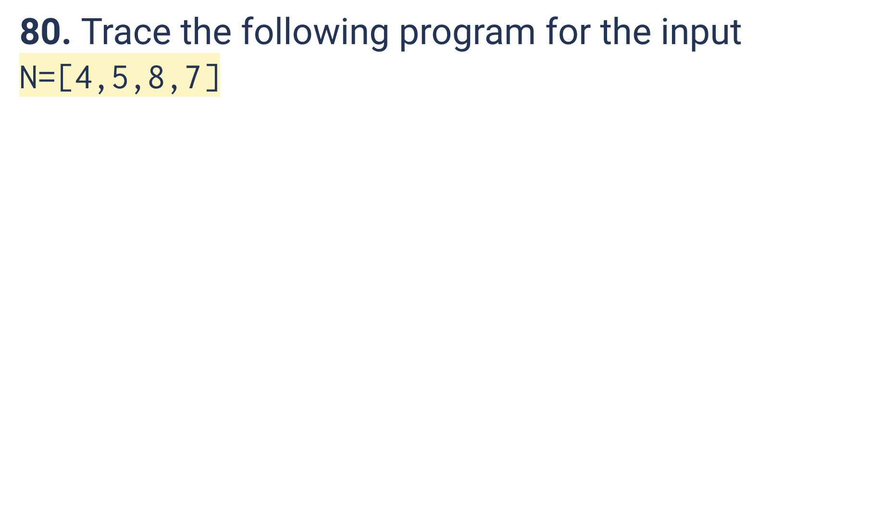
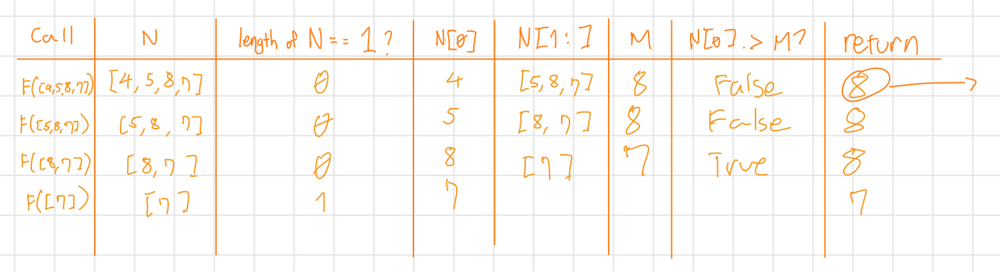
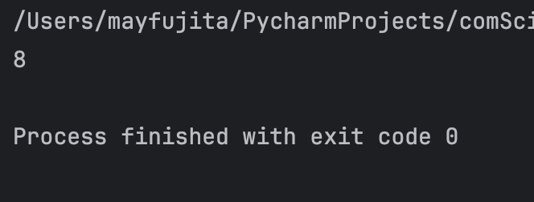

# Quiz 080
<hr>

### Prompt

*fig. 1* **Screenshot of quiz slides**

### Working

*fig. 1* **Screenshot of working**

### Solution
```.python
def function(n: list[int]) -> int:
    if len(n) == 1:
        return n[0]
    else:
        m = function(n[1:])
        if n[0] > m:
            return n[0]
        else:
            return m


# Test that it works
print(function(n=[4, 5, 8, 7]))
```
### Evidence

*fig. 2* **Screenshot of working/solution**